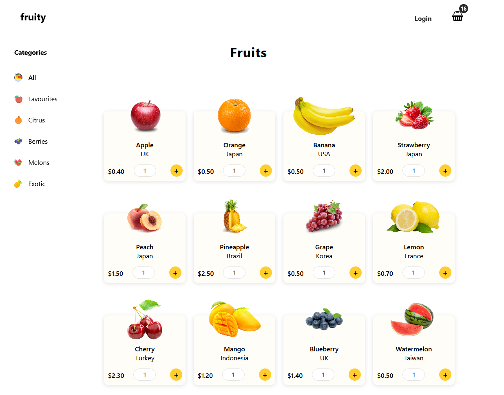

<!-- PROJECT LOGO -->
<br />
<p align="center">
  <a href="https://github.com/hcwtam/projects/tree/master/035-ecommerce">
    
  </a>

  <h3 align="center">Fruity</h3>

  <p align="center">
    An e-commerce application for online grocery shopping. Includes an easy-to-use checkout, detail page for your favourite products, and own purchase history for your reference.
    <br />
    <br />
    <a href="https://fruity-store.web.app/">View Demo</a>
    ·
    <a href="https://github.com/hcwtam/projects/issues">Report Bug</a>
    ·
    <a href="https://github.com/hcwtam/projects/issues">Request Feature</a>
  </p>
</p>

## Built With

- [React](https://reactjs.org/)
- [React Redux](https://react-redux.js.org/)
- [React Router](https://reactrouter.com/)
- [CSS Modules](https://github.com/css-modules/css-modules)
- [Firebase](https://firebase.google.com/docs)
- [Formik](https://formik.org/)

<!-- GETTING STARTED -->

## Getting Started

To get a local copy up and running follow these simple steps.

### Prerequisites

- npm

```sh
npm install npm@latest -g
```

### Installation

1. Clone the repo

```sh
git clone https://github.com/hcwtam/projects/tree/master/035-ecommerce
```

2. Install NPM packages

```sh
npm install
```

<!-- CONTACT -->

## Contact

Please feel free to contact me:

Email - [hcwtam@gmail.com](hcwtam@gmail.com)

Project Link: [https://github.com/hcwtam/projects/tree/master/035-ecommerce](https://github.com/hcwtam/projects/tree/master/035-ecommerce)
